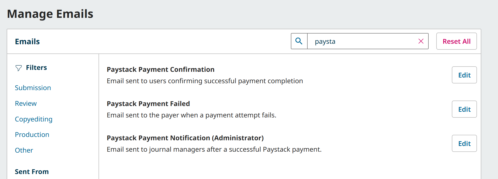
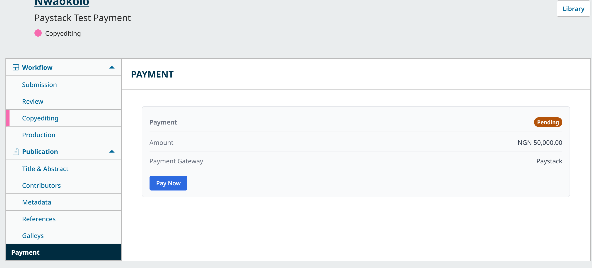
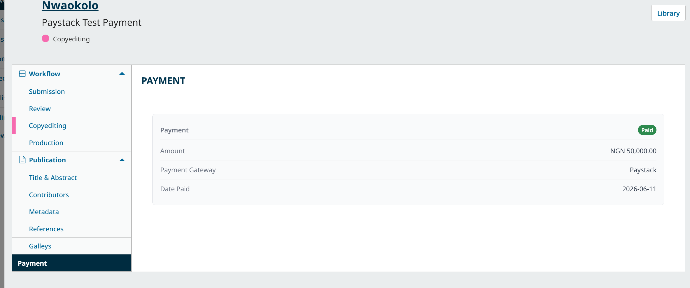

# OJS Paystack Payment Gateway

<table>
<tr>
<td><strong>Version</strong></td><td>1.1.0</td>
<td><strong>OJS</strong></td><td>3.5.0+</td>
<td><strong>PHP</strong></td><td>8.1+</td>
<td><strong>License</strong></td><td>GPL-3.0-or-later</td>
</tr>
</table>

[](https://github.com/thathman/PaystackOJS/actions/workflows/ci.yml)
[](https://github.com/sponsors/thathman)

Accept payments in Open Journal Systems 3.5 through [Paystack](https://paystack.com) — article and issue purchases, subscriptions, and publication fees. The reader pays on Paystack's hosted checkout; the plugin verifies every payment server-side before marking it fulfilled.

Supported currencies: **NGN, USD, GHS, ZAR, KES, XOF** (your Paystack account must be eligible for the currency you charge in).

---

## Features

- Hosted Paystack checkout — card details never touch your server
- Server-side verification on both the browser return **and** the webhook: amount, currency, and reference are re-checked against the queued payment before anything is fulfilled
- Webhook authenticity via HMAC-SHA512 over the raw body, compared with `hash_equals()`
- Optional webhook **IP allowlist** against Paystack's documented source IPs
- Idempotent fulfilment: DB-backed webhook dedupe (30-day TTL) plus a unique-insert guard that closes the race between the callback and the webhook
- Manager **Transactions** list with full and partial refunds
- User-facing **payment history** and **receipt** pages (ownership-checked)
- Submission **Payment tab** in the editorial workflow — fee status, amount, gateway, and a Pay Now button (via the [Payment Method Support companion](#submission-payment-tab-companion-addon))
- Payment emails via OJS-native templates — payer confirmation, failure notice, manager notification
- File-based logging with a configurable level per journal
- No bundled dependencies (uses the Guzzle client shipped with OJS core) and zero modifications to OJS core files — hooks only

---

## Requirements

| | Minimum version |
|---|---|
| OJS | 3.5.0 |
| PHP | 8.1 |

---

## Installation

### Manual

1. Download `paystack-1.1.0.0.tar.gz` from the [Releases](../../releases) page.
2. Unpack into `plugins/paymethod/` so the result is `plugins/paymethod/paystack/`.
3. In OJS go to **Settings › Website › Plugins › Plugin Categories › Payment Plugins** and enable **Paystack Payment Gateway**.
4. In **Settings › Distribution › Payments**, enable payments, pick your currency, and choose Paystack as the payment method.
5. Fill in your API keys on the same page (the Paystack group appears below the core payment settings).

> **Note — versions table**
>
> If you drop the files in manually without using the OJS plugin installer, run this once after copying the files so OJS detects the plugin and creates its tables:
>
> ```
> php lib/pkp/tools/installPluginVersion.php plugins/paymethod/paystack/version.xml
> ```
>
> The Plugin Gallery installer handles this automatically.

---

## Configuration

| Setting | Default | Description |
|---------|---------|-------------|
| Test mode | off | Use Paystack test keys (`sk_test_…` / `pk_test_…`); a banner shows while enabled |
| Test / Live keys | — | Secret + public key pairs from your Paystack dashboard; secrets are masked after saving |
| Log level | Warning | Verbosity of the plugin log under `files_dir/paystack_logs/` |
| Webhook IP allowlist | off | Only accept webhooks from Paystack's documented IPs (52.31.139.75, 52.49.173.169, 52.214.14.220). Leave off behind CDNs/proxies that hide the client IP. |

In your Paystack dashboard set the callback and webhook URLs shown on the settings page:

```
Callback:  {journalUrl}/payment/plugin/paystackplugin/callback
Webhook:   {journalUrl}/payment/plugin/paystackplugin/webhook
```

---

## How it works

```
Reader clicks Pay        POST /payment/plugin/paystackplugin/initiate
                           CSRF + ownership checks
                           POST /transaction/initialize (Paystack API)
                           redirect to Paystack-hosted checkout

Reader pays              Paystack redirects to /callback?reference=...
                           GET /transaction/verify/<reference> (server-side)
                           re-check amount + currency + reference + payment id
                           atomic fulfilment guard (webhook may race)
                           confirmation page + emails

Paystack fires webhook   POST /webhook  (x-paystack-signature)
                           optional IP allowlist check
                           HMAC-SHA512 over raw body, hash_equals()
                           dedupe table check (30-day TTL)
                           re-check amount + currency
                           fulfil if the callback has not already done so
```

---

## Security

### Temporary OJS APC ownership compatibility

OJS 3.5 currently creates publication-fee queues under the editor who requests
the payment while sending the payment link to the assigned author. See
[pkp/pkp-lib#12885](https://github.com/pkp/pkp-lib/issues/12885).

Until that is fixed upstream, this plugin may transfer an editor-owned APC
queue to the logged-in user only when that user is the submission's primary
assigned author, or the sole assigned author when no primary author can be
resolved. All other users and all non-APC payment types remain denied. This
path is a no-op for correctly owned queues and should be removed after the
minimum supported OJS release includes the core fix.

| Property | Implementation |
|----------|----------------|
| Webhook authenticity | HMAC-SHA512 over the raw body, `hash_equals()` |
| Webhook origin | Optional allowlist of Paystack's documented source IPs |
| Payment tampering | Amount + currency + reference re-verified against the queued payment on callback and webhook |
| Replay / double-fulfilment | DB-backed dedupe with TTL + unique-insert fulfilment guard |
| Card data / PCI | Never touches the journal server — Paystack-hosted checkout only |
| Secrets | Masked in the settings UI; masked placeholders are never written back |
| Transport | HTTPS enforced outside test mode |
| CSRF | OJS CSRF token on every mutating endpoint |
| Core changes | None — the plugin is entirely hook-based |

---

## Email templates

Payment emails are sent automatically using OJS-native templates installed with the plugin (a safe built-in fallback ensures mail is never lost):

| Key | Sent to |
|-----|---------|
| `PAYSTACK_PAYMENT_CONFIRMATION` | Payer, on successful payment |
| `PAYSTACK_PAYMENT_CONFIRMATION_ADMIN` | Journal contact, on successful payment |
| `PAYSTACK_PAYMENT_FAILED` | Payer, when a charge fails |

Due to an OJS restriction, paymethod plugins are only loaded on payment pages, so these templates cannot be *listed or edited* under **Settings › Emails** from this plugin alone (they still send correctly). The optional **Payment Method Support** companion addon bridges this gap — it makes the templates editable in the OJS UI and adds a theme-agnostic "Payment History" link to the user navigation. The addon is available to sponsors of this plugin; sponsorship funds ongoing maintenance and PKP-compatibility updates. Sponsor via **[GitHub Sponsors](https://github.com/sponsors/thathman)** or contact **hello@airixmedia.com**. Access is automatic: within the hour of sponsoring you'll receive a GitHub invitation to the private addon repository — accept it and download the addon from its Releases page.

With the companion enabled, the gateway templates become searchable and editable like any other OJS email:



---

## Submission Payment tab (companion addon)

The **Payment Method Support** companion (same sponsor addon as above) also adds a **Payment** tab to the submission panel in the editorial workflow. Editors and the payer see the publication fee's status at a glance — amount, gateway, and date paid — and the payer gets a **Pay Now** button that starts the normal Paystack checkout for the queued fee:



Once the payment completes (callback or webhook), the tab reflects it:



The tab is gateway-agnostic: it reads OJS's own queued/completed payment records, so it requires no Paystack-specific setup. It appears only when publication fees are enabled for the journal, and the payment status endpoint is ownership-checked (the payer, assigned editors, and managers).

> **Requires:** OJS 3.5+, this gateway plugin enabled, and the Payment Method Support companion **1.2.0+** installed and enabled (available to sponsors — see [Email templates](#email-templates) above for how access works). Without the companion, payments still work normally through the payment links OJS emails to the payer; you just don't get the in-workflow tab.

---

## Screenshots

The full payment journey with this plugin and the companion addon:

| Step | Screenshot |
|------|------------|
| Plugin settings (Settings › Distribution › Payments) | [settings.png](docs/screenshots/settings.png) |
| Fee request email with Pay Now button | [email-payment-request.png](docs/screenshots/email-payment-request.png) |
| Workflow Payment tab — pending | [workflow-payment-tab-pending.png](docs/screenshots/workflow-payment-tab-pending.png) |
| Reader-facing payment page | [payment-page.png](docs/screenshots/payment-page.png) |
| Paystack hosted checkout (test mode) | [paystack-test-checkout.png](docs/screenshots/paystack-test-checkout.png) |
| Receipt page after verification | [payment-receipt.png](docs/screenshots/payment-receipt.png) |
| Payer confirmation email | [email-payment-received.png](docs/screenshots/email-payment-received.png) |
| Workflow Payment tab — paid | [workflow-payment-tab-paid.png](docs/screenshots/workflow-payment-tab-paid.png) |
| Editable email templates (companion) | [manage-emails-templates.png](docs/screenshots/manage-emails-templates.png) |
| Payment History link in the user menu | [payment-history-nav.png](docs/screenshots/payment-history-nav.png) |
| Payment History page (totals + all transactions) | [payment-history.png](docs/screenshots/payment-history.png) |

---

## Theming

The payment details, confirmation, history, and receipt pages ship as neutral single-column templates that work with any theme. To apply your own design, place overrides in your theme directory:

```
plugins/themes/<yourtheme>/
  templates/
    plugins/
      paymethod/
        paystack/
          templates/
            paymentDetails.tpl
            paymentConfirmation.tpl
            paymentHistory.tpl
            paymentReceipt.tpl
```

---

## Roadmap

| Version | Status | Description |
|---------|--------|-------------|
| 1.0.0 | Released | Hosted checkout + callback + webhook flow with HMAC verification and idempotent fulfilment |
| 1.1.0 | Released | Optional webhook IP allowlist; TTL'd DB-backed idempotency; PKP-native install migrations |
| 1.2.0 | Planned | Split payments / subaccount support for multi-journal revenue sharing |

See [CHANGELOG.md](CHANGELOG.md) for details.

---

## Contributing

Pull requests are welcome. Please open an issue first for anything beyond a small bug fix.

---

## License

GNU General Public License v3.0 or later. See [`LICENSE`](LICENSE) for the full text.
